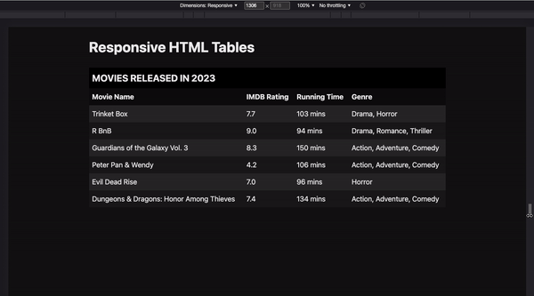

# Responsive HTML Tables

HTML table usually doesn't play nice in small screen sizes. This repository contains a small implementation on how to make tables responsive.

**Result**

### Inspired from: 
[Kevin Powell's video](https://www.youtube.com/watch?v=czZ1PvNW5hk)

### Further Readings:

* Adrian Roselli: [A Responsive Accessible Table](https://adrianroselli.com/2017/11/a-responsive-accessible-table.html)
* Adrian Roselli: [Function to Add AIRA to Tables and Lists](https://adrianroselli.com/2018/05/functions-to-add-aria-to-tables-and-lists.html)